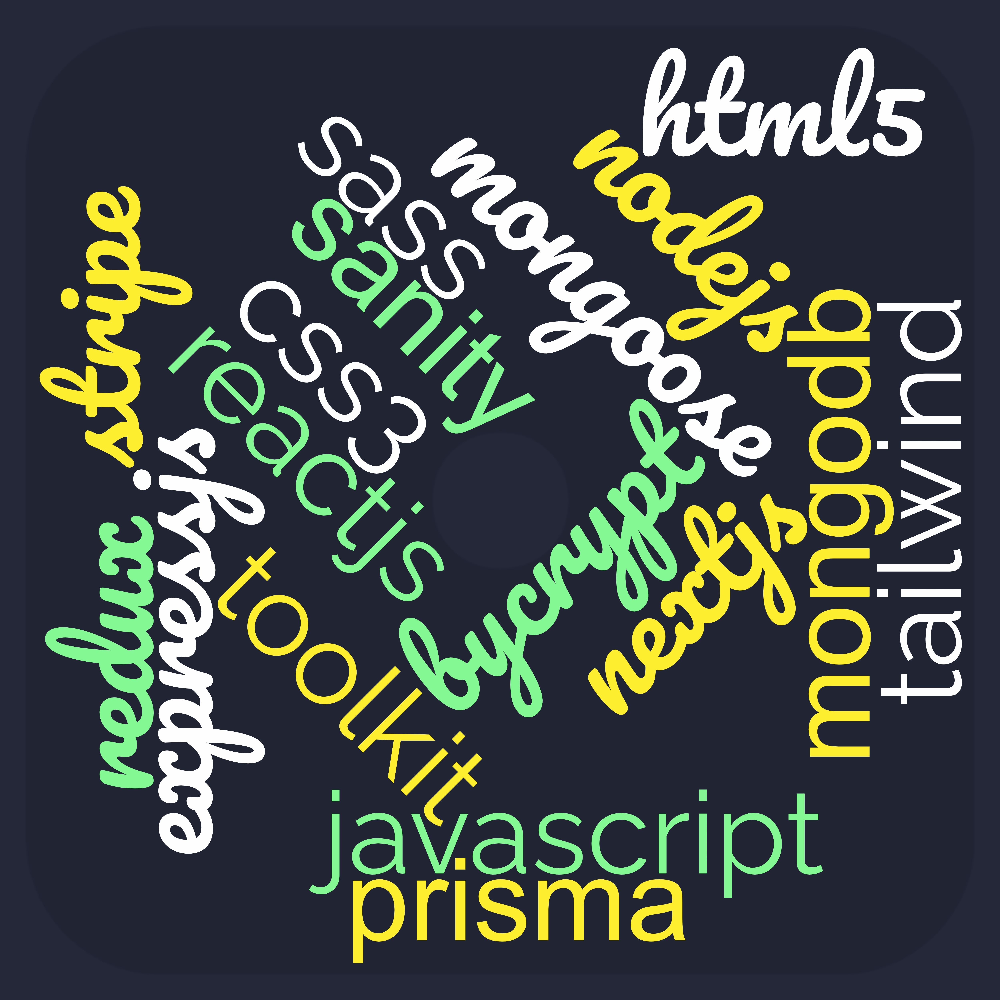

<h1 align="center">Hi 👋, I'm Faiyaj Bin Ahmed</h1>
<h3 align="center">A passionate frontend developer from Bangladesh</h3>

I'm a seasoned web developer proficient in MERN Stack and Next js. My journey in web development has been characterized by a relentless pursuit of creating highly functional and user-centric digital experiences. I'm passionate about transforming my client's visions into reality consistently seeking innovative approaches to elevate the digital landscape. Thank you for your time. Hope to work together soon.

- 👨‍💻 All of my projects are available at [faiyaj.com](faiyaj.com)

- 📫 How to reach me **faiyajahmed710@gmail.com**

<h3 align="left">Connect with me:</h3>

